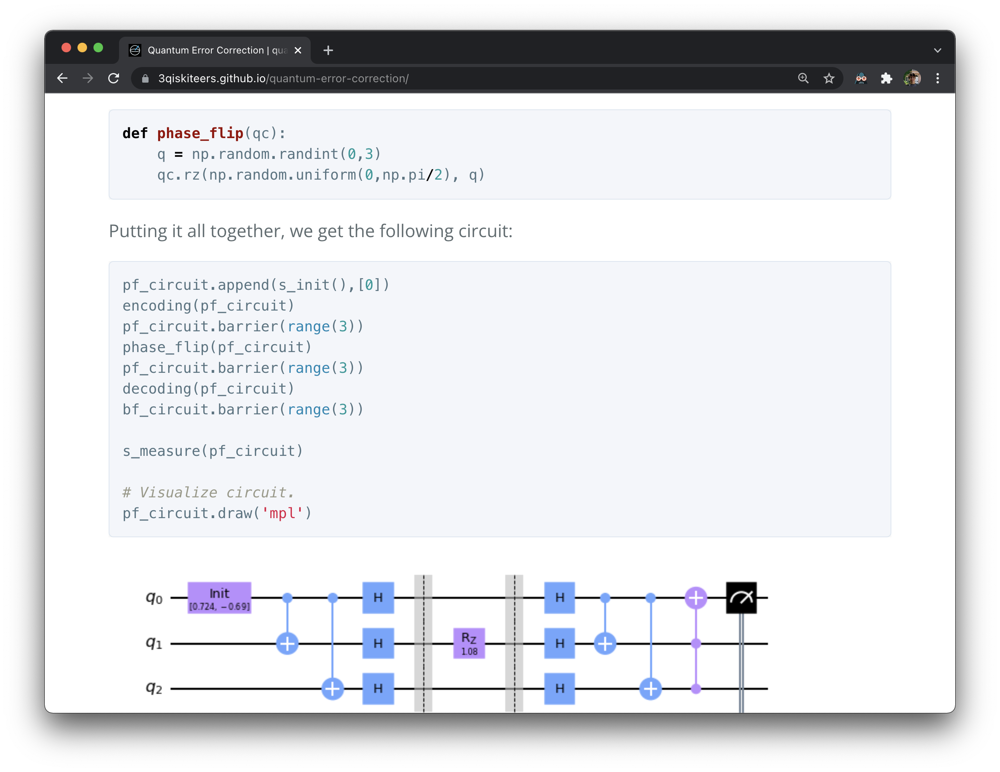

# quantum-error-correction

An explanation of quantum decoherence and how the Shor Code can circumvent it. Click [here](https://3qiskiteers.github.io/quantum-error-correction/) to view the tutorial and code.
