# 0. Our Goal
This project, designed by Julian Quevedo, Michael Robertson,
and Brion Ye for the Phys14N class taught by Professor Monika Schleier-Smith,
is designed to educate students about the properties and utility of quantum error correction,
the working principle behind a well-known basic error correction scheme known as Shor’s 9-bit code,
and the future of quantum error correction.

# 1. What is quantum computing?
Quantum computing, to put it simply, is a potential candidate for complete computational revolution. It revolves around the concept of qubits -- unlike a classical bit that is always either discretely 0 or 1, a qubit is able to remain in a quantum superposition of 0 and 1. Quantum algorithms exploit this superposition to perform simultaneous calculations on exponentially more logical states than possible with a classical computer.

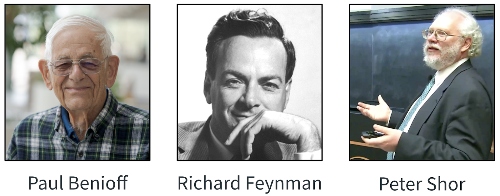

The concept was first imagined (in the form of a quantum Turing-complete machine) in the early 1980s by a physicist named Paul Benioff. Subsequently, other physicists and computer scientists became attracted to the notion of quantum computing, believing that it will possess abilities beyond that of a classical computer. In 1994, Peter Shor created one of the first concrete examples of a relevant use case for quantum computing when he introduced a quantum algorithm which could factorize large integers into their prime factors in polynomial time. For the first time, the exponential speedup and practical applications of quantum computing were realized -- at least in theory. Though Shor’s algorithm was universally acclaimed, many scientists doubted that it would ever become more than a theoretical interest simply due to instabilities inherent to quantum systems.

# 2. Why do we need quantum error correction?
By the 90s, physicists were well aware of the sensitive nature of quantum systems, as even the smallest of unintended interactions could destroy the state of a qubit.  With systems as sensitive as single atoms, it seemed inevitable that algorithms such as Shor’s would fall apart. The phenomenon behind all of this physical instability is known as quantum decoherence.


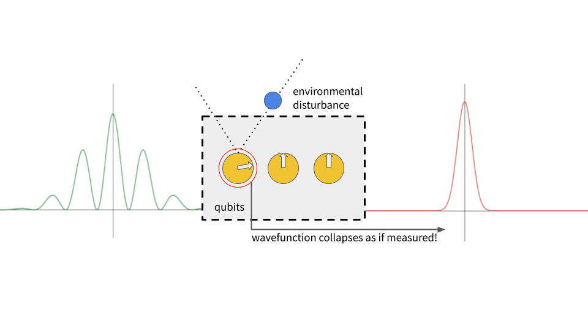

Quantum decoherence is the result of an unintended interaction between a qubit and the environment, which ends up irreversibly disturbing the qubit’s wavefunction. By environment, we mean everything outside our quantum subsystem; one example could be the air molecules flowing between the circuit elements on our computer. The environment is out of our control; we cannot measure it or apply quantum gates to investigate it. Because of this, interactions with the environment appear to destroy the quantum information in our circuit, as we are unable to interact with it to retrieve the lost information. The information is “lost” in the first place because, when two quantum objects interact, they become correlated, or entangled, “spreading” the information between them.
If we could examine the universe’s wavefunction as a whole, we would see that information is conserved and that in theory it is possible to retrieve this information to reconstruct our quantum system. However, our limited perspective only allows us to see half of the story, and hence we observe decoherence, or a loss of the original quantum superposition. Quantum noise can generally manifest as either the resetting of the qubit to $$\ket{0}$$ or a deviation in the qubit that knocks it into another position via a random unitary operator (which we will describe in detail later).

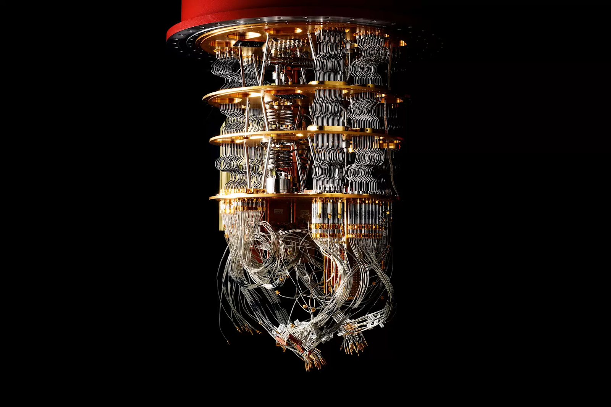

With the help of modern technology, scientists have successfully isolated quantum circuits to an incredible degree. The quantum "chandelier" developed by Google (pictured above) is suspended in the air to mitigate tectonic vibrations and cooled to near absolute zero to minimize kinetic energy effects from temperature in the atoms. However, even with all physical precautions at the macroscopic level, qubits are still fragile enough to decohere at an unsustainable frequency if we try to scale it to an industry-level technology.
With no practical way to perfectly shield our quantum circuits, we had to invent another way to circumvent the sensitivity of quantum systems and create large-scale quantum computers. Only then could we finally realize the prospects of things such as Shor’s factoring algorithm. The answer was quantum error correction.

# 3. Classical vs Quantum EC
The breakthroughs in classical computing theory of the past decades have changed the world perhaps more than any other technology. We have already learned a lot about error correction in integrated circuits and transmission of data over the internet. Can’t we use that knowledge and experience and apply it to quantum circuits?

The issue is that classical error correction techniques make use of assumptions that are fundamentally wrong in the quantum realm. In classical systems, ensuring data fidelity involves creating redundancies through making multiple copies of the desired information. However, in quantum mechanics, a physical law known as the No-Cloning Theorem proves that it is impossible to directly copy a quantum superposition state.

Classical error codes also rely on making measurements of the data over time; after all, it's the most natural way to diagnose and correct errors as they occur. However, measurement inherently collapses quantum states; maybe we can diagnose the error, but in the process we have destroyed the very thing we tried to protect. This means we should avoid measurements of qubit systems at all costs. The other difference is that classical error codes are mostly used in the transmission of data over distances.

So, if we can't copy or measure the data, how are we supposed to protect it?
This is where quantum mechanics finally redeems itself; we can use the concept of quantum entanglement to ensure that although any one qubit may be corrupted, the joint product state of a group of qubits will remain similar enough that we can perform error correcting operations to fix the corrupted qubit, *without ever directly copying or measuring a single qubit*.
Hooray! We have our modus operandi. 
<p align="center">
  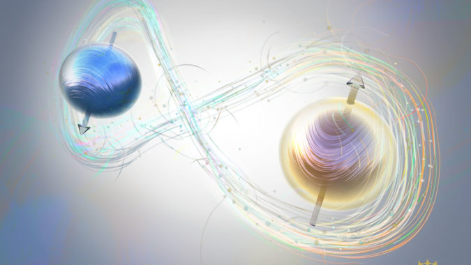
</p>
Now, we can properly dive into the ideas that Peter Shor used to develop the first complete error correcting code.

# 4. Types of Quantum Errors
Bit-flip codes account for situations where $$\ket{0}$$ gets flipped to $$\ket{1}$$ or $$\ket{1}$$ gets flipped to $$\ket{0}$$. These errors are represented by the X operator.

Phase-flip codes, account for situations when $$\ket{0} + \ket{1}$$ becomes $$\ket{0} - \ket{1}$$. These kinds of errors are represented by the Z operator.

Both of these types of phenomenon are encountered often in nature. In order to have what is known as a complete error correcting code, it must be able to deal with any unitary operator, which may be a combination of bit-flips and phase-flip codes.

# 5. The Bit-Flip Code

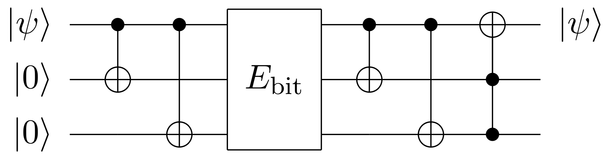

The first step of the process is encoding. Here we’re going to take advantage of quantum mechanics and create an entangled state. $$\ket{\psi}$$ is the state we want to keep intact at the end of the day. Then, we have two CNOT gates applied one after another. This entangles all three qubits.

Next is the random environmental error. Since we are doing the bit flip code, we can correct for any rotation around the x axis.

In the decoding stage, this is where we hopefully ensure $$\ket{\psi}$$  has the correct state. The CNOTs are applied once more, followed by a Toffoli gate (also known as a CCNOT gate). It is hard to fully describe the nature of the Toffoli gate, but a good classical approximation is to say that it will flip the state of the third qubit if and only if both of the other qubits are in the 1 state.

Let’s say each qubit in our circuit has probability p of X being applied to it “by the environment” every timestep. To account for this, we can define one logical qubit using 3 physical qubits. For example, the $$\ket{0}$$  logical state will be expressed as $$\ket{000}$$ and the $$\ket{1}$$ logical state will be expressed as $$\ket{111}$$. A classical algorithm would achieve this by simply making two copies of the original bit, then taking a “majority vote” at the end of processing. As mentioned earlier, creating copies is impossible with this quantum architecture, so we instead distribute its information across two ancilla qubits using two sequential CNOT gates. Again, the quantum aspect of this operation is hard to describe, but a classical analogy is that the ancilla qubits are initially in the $$\ket{0}$$ state, so, if our arbitrary state $$\ket{\psi}$$  is in the $$\ket{1}$$ state, they will get flipped to the $$\ket{1}$$ state as well. If $$\ket{\psi}$$ is in the $$\ket{0}$$ state, nothing happens, and all qubits remain in the $$\ket{0}$$ state.

Error codes are generally broken into a 3 step process: encoding, simulated error, and decoding. What we have so far is the encoding stage. Next is the error simulation, also called a “noisy channel,” in which any subset of three qubits may have X applied to them at random. Since $$p$$ is the probability of a bit-flip, Each qubit has a probability of $$1-p$$ of being transmitted correctly.

The rest of the circuit involves applying another two CNOT gates in a similar fashion, followed by a CCNOT or Toffoli gate on $$\ket{\psi}$$. The Toffoli gate will only flip $$\ket{\psi}$$ if both ancilla bits are in the $$\ket{1}$$  state. So, assuming only 1 qubit has been flipped in the noisy channel, let’s see how this circuit works!


If the first bit is flipped, then the ancilla bits always become the $$\ket{1}$$ state, and thus the Toffoli takes care of the correction. If either of the ancilla bits are flipped, the Toffoli will not activate, so the state of $$\ket{\psi}$$ is not disturbed.

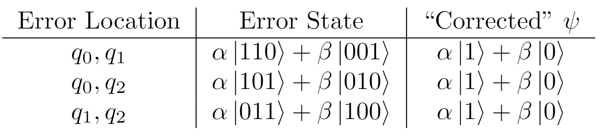

What happens if two bits are flipped? In this case, two bit-flips are indistinguishable from a single bit-flip on the other qubit. For example, if $$\ket{\psi}$$ and one of the ancilla bits are flipped, the Toffoli will never activate, as the two ancilla bits will always be different. This means that $$\ket{\psi}$$ will not be reverted to its original value. If instead it is both ancilla bits which are flipped, the Toffoli will activate on a false-positive, as they will both end up in the $$\ket{1}$$  state. This time, $$\ket{\psi}$$ is accidentally flipped into the incorrect state, even though it was correct in the first place.

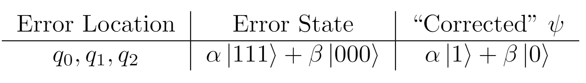

What if all three bits are flipped? This situation turns out to be equivalent to no flips occurring at all. In this case, both ancilla bits will always end up in the $$\ket{0}$$  state, which will fail to activate the Toffoli and leave $$\ket{\psi}$$ in the incorrect state.

In conclusion, the 3-bit code can only account for a single bit flip.

Concretely, how much does using the 3-bit code help us? We know it will only work if 0 or 1 of our 3 qubits are flipped. The probability of none being flipped is $$(1-p)^3$$, while the probability of any single qubit being flipped is $$p(1-p)^2$$. So, the combined probability of our error code reproducing the correct state is $$(1-p)^3 + 3p(1-p)^2$$. If we didn’t use error correction, the probability of $$\ket{\psi}$$ being correctly transmitted is just $$1-p$$, as mentioned before. Plotting the fidelity vs $$p$$, we see that the 3-bit code will result in higher fidelity as long as the probability of a bit flip is less than 50%. Once the probability becomes higher than 50%, however, the problems associated with 2 or 3 bit-flips dominate.

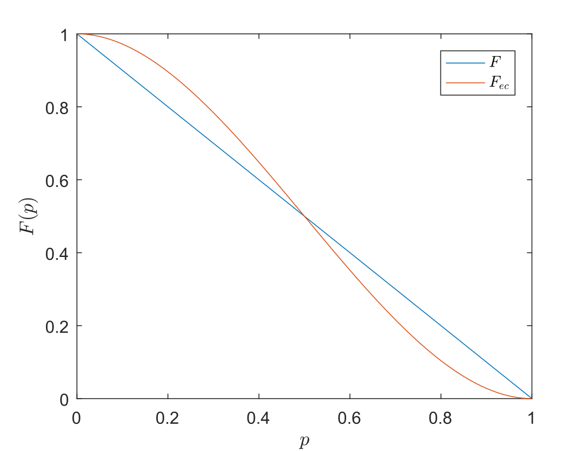

In reality, the case of greater than 50% error will likely never happen. For a realistic quantum system that has already been thermally and kinetically isolated, such as the Google "chandelier" pictured in the earlier section, the probability of a single qubit being corrupted is several order of magnitude smaller than 50%; therefore, with this error correction scheme, the total error rate should theoretically drop to nearly 0.

## Implementation
This all makes sense in theory, but it is equally important to verify the bit-flip code experimentally. There are several popular quantum computing frameworks, but the one we’ll be using is Qiskit for Python. If you don’t have it installed already, use the command `pip install qiskit`.

Start by importing the necessary modules. We’ll be needing several `qiskit` functions such as the `Initialize` custom gate as well as a few functions for visualizing our experimental results.

```python
from qiskit import *
from qiskit.visualization import plot_histogram, plot_state_city, plot_bloch_multivector
from qiskit.extensions import Initialize
import numpy as np
```

Next, initialize the quantum circuit in the above diagram. We will need three qubits corresponding to $$q_0$$, $$q_1$$, and $$q_2$$, as well as one classical bit to store our measurement results.

```python
bf_circuit = QuantumCircuit(3,1)
```

We want to be able to correct errors for any arbitrary state $$\ket{\psi}$$. Define `s_init` to pick a random pair of amplitudes, using them to create a custom “initialization gate” which will be applied to $$q_0$$ at the beginning of the program.

```python
def s_init():
    n = np.random.uniform(0,np.pi)
    psi = [np.sin(n),np.cos(n)]
    init_psi = Initialize(psi)
    init_psi.label = "init"
    return init_psi
```

Next is the encoding stage. Simply apply two CNOT gates to the desired quantum circuit `qc`. The first parameters are the indexes of the control bit followed by the target bit, respectively. Since we want to entangle the ancillary bits, both of the controls should be set to the index of $$q_0$$, `0`.

```python
def encoding (qc):
    qc.cx(0,1)
    qc.cx(0,2)
```

Next, we need to introduce a random error, represented as a rotation about the $$x$$-axis by some arbitrary angle.

```python
def bit_flip(qc):
    q = np.random.randint(0,3)
    qc.rx(np.random.uniform(0,np.pi/2), q)
```

Now, decode the qubit by applying two more CNOT gates on the ancillary bits, followed by a Toffoli (CCNOT) whose target bit is $$q_0$$.

```python
def decoding(qc):
    qc.cx(0,1)
    qc.cx(0,2)
    qc.ccx(1,2,0)
```

Last but not least, measure the state of the original qubit and store the result in index `0` of the classical register.

```python
def s_measure(qc):
    qc.measure(0,0)
```

Putting it all together and visualizing the circuit, we get:

```python
bf_circuit.append(s_init(),[0])
encoding(bf_circuit)
bf_circuit.barrier(range(3))
bit_flip(bf_circuit)
bf_circuit.barrier(range(3))
decoding(bf_circuit)
bf_circuit.barrier(range(3))

s_measure(bf_circuit)

# Visualize circuit.
bf_circuit.draw('mpl')
```

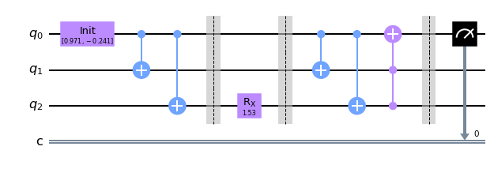

Now to test our circuit, all we have to do is choose a platform to run it on and plot the results. In this case, we will choose the quantum simulator.

```python
backend = BasicAer.get_backend('qasm_simulator')
counts = execute(bf_circuit, backend, shots=1024).result().get_counts() # No. of measurement shots = 1024
plot_histogram(counts)
```

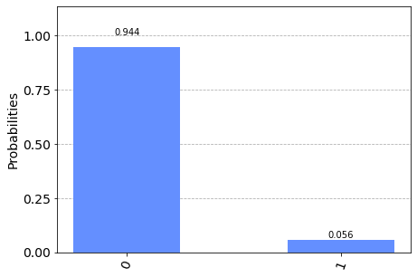

# 6. The Phase-Flip Code
As it is a close cousin of the bit-flip code, the circuit for correcting random phase-flips is very similar. The only difference is that there are three extra Hadamard gates at the end of the encoding sequence, and three more at the beginning of the decoding sequence.

For example, let’s say $$\ket{\psi}$$ is $$\ket{0}$$ . It will become $$\frac{1}{\sqrt{2}}(\ket{0} + \ket{1})$$ after passing through the Hadamard gate. Then, due to some environmental disturbance, it flips to the $$\frac{1}{\sqrt{2}}(\ket{0} - \ket{1})$$ state. After passing through the second Hadamard, it is now in the $$\ket{1}$$  state. The rest of the circuit decodes in exactly the same way as the bit-flip code did.

## Implementation
Testing the phase-flip code with Qiskit is a very similar process. All we need to do is add the three Hadamard gates at the end of the encoding state and the beginning of the decoding stage!

```python
def encoding (qc):
    qc.cx(0,1)
    qc.cx(0,2)
    qc.h(0)
    qc.h(1)
    qc.h(2)

def decoding(qc):
    qc.h(0)
    qc.h(1)
    qc.h(2)
    qc.cx(0,1)
    qc.cx(0,2)
    qc.ccx(1,2,0)
```

Also, we need to change our original error function so that it instead introduces a random rotation around the $$z$$-axis.

```python
def phase_flip(qc):
    q = np.random.randint(0,3)
    qc.rz(np.random.uniform(0,np.pi/2), q)
```

Putting it all together, we get the following circuit:

```python
pf_circuit.append(s_init(),[0])
encoding(pf_circuit)
pf_circuit.barrier(range(3))
phase_flip(pf_circuit)
pf_circuit.barrier(range(3))
decoding(pf_circuit)
bf_circuit.barrier(range(3))

s_measure(pf_circuit)

# Visualize circuit.
pf_circuit.draw('mpl')
```

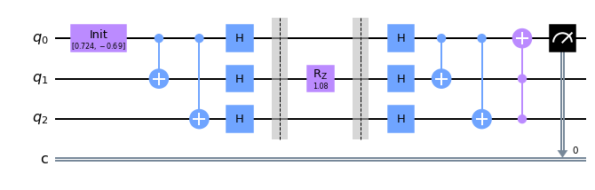

Testing it on the simulator again, you can see that the state of $$q_0$$ is preserved. The probabilities of measuring a $$\ket{0}$$ or $$\ket{1}$$ are equal to the original amplitudes squared.

```python
backend = BasicAer.get_backend('qasm_simulator')
counts = execute(pf_circuit, backend, shots=1024).result().get_counts() # No. of measurement shots = 1024
plot_histogram(counts)
```

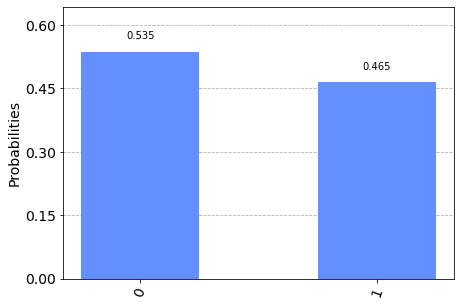

# 7. The Complete Shor 9 Bit Code
The above two three-bit codes are certainly useful for specific types of error, but they won’t be enough by themselves. A qubit “error” (whether it be an environmental disturbance or a malfunctioning logic gate or any other factor) can be generally expressed as a unitary operator of form $$E=aI+bX+cY+dZ$$, where $$I/X/Y/Z$$ are the Pauli operators and $$a/b/c/d$$ are coefficients such that $$a^2+b^2+c^2+d^2=1$$. Clearly the domain of possible unitary errors encompasses much more than a simple bit flip or phase flip.
However, what happens if we combine the two gates somehow? Notice that the expression for the error can be simplified: $$E=aI+bX+c(XZ)+dZ$$. This is because a $$180^\circ $$ $$Y$$ axis rotation is equivalent to a $$180^\circ$$ $$X$$ rotation followed by a $$180^\circ$$ $$Z$$ rotation. Now the relationship becomes more clear; although $$E$$ cannot be represented as pure $$X$$ rotations or pure $$Z$$ rotations, it can be entirely represented by a combination function of the two.
A graphical explanation on the Bloch Sphere may make things clearer. Say you have a qubit $$a\ket{0}+b\ket{1}$$ that you want to transmit (the one displayed in the image is )
The bit-flip code is capable of correcting any error that places the qubit along the same circle about the $$X$$-axis:

The phase-flip code, in contrast, can handle anything along the same circle about the $$Z$$-axis:

By visual inspection, it is easy to see that rotating about these two axes by some amount will allow the qubit vector to travel anywhere on the Bloch sphere; and, conversely, to allow any error vector on the Bloch sphere to return to the same original point.

Shor’s 9-bit code does exactly this. A full circuit diagram is pictured below:

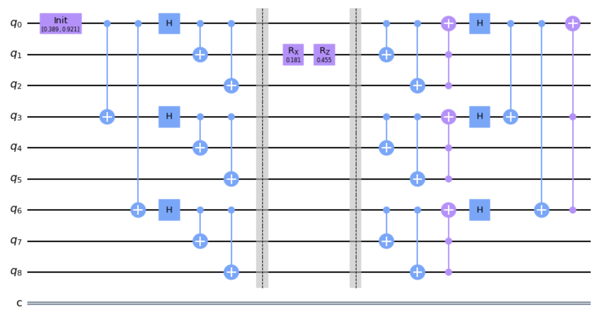

The circuit diagram looks intimidating. What are all those CNOT gates doing there? It’s hard to wrap our heads around this circuit directly, but things become a little clearer when we consider the seemingly recursive nature of the circuit. Take the middle sections of the circuit:

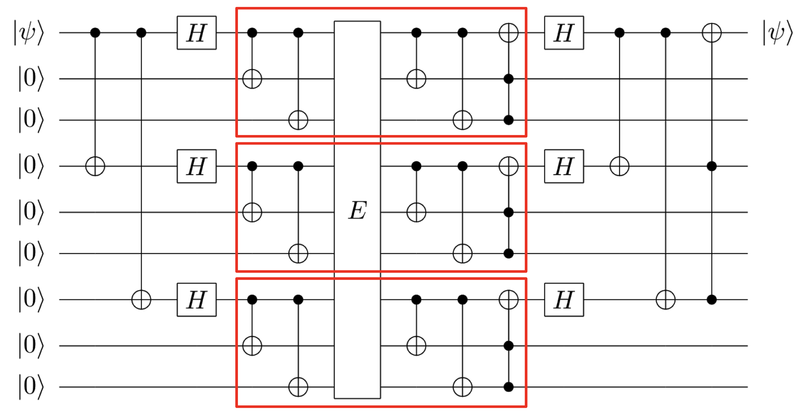

These three sections are identical to the circuit configuration for the 3-qubit bit flip code we discussed earlier! Each group of three qubits undergoes the same operation that corrects any bit-flip (or X rotation) that may have resulted from the noisy channel.

Next, look at the outer sections:

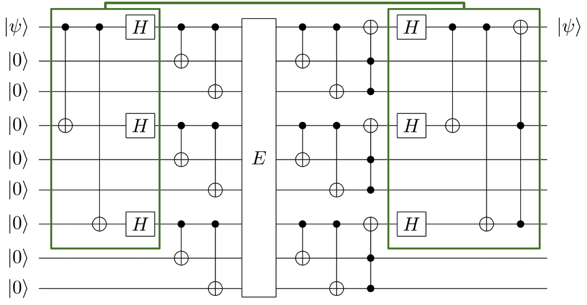

Yet again, we see a familiar face: the 3-qubit phase flip code also appears across every third qubit in the circuit! Each group of three qubits, represented by a single header qubit, collectively runs through this circuit to correct any phase-flip (or $$Z$$ rotation) that may have resulted from the noisy channel.

In this way, the Shor code is akin to a quantum Lego set. When we send 9 entangled qubits, there could be both a bit flip and a phase flip hiding among them. The outer phase flip code only corrects for one type of error. However, if we split the 9 qubits into 3 logical “groups of qubits” and correct for the bit flip within, we can be sure that the “logical qubit” reaching the phase flip code is $$X$$-rotation-free. After the phase-flip is corrected, we are left with the final qubit that has been corrected of all types of error.

Feel free to explore the behind-the-scenes code that makes this run!

```python
def encoding(qc):
    qc.cx(0,3)
    qc.cx(0,6)
    qc.h(0)
    qc.h(3)
    qc.h(6)
    qc.cx(0,1) 
    qc.cx(0,2) 
    qc.cx(3,4) 
    qc.cx(3,5)
    qc.cx(6,7) 
    qc.cx(6,8)
def decoding(qc):
    qc.cx(0,1) 
    qc.cx(0,2) 
    qc.cx(3,4) 
    qc.cx(3,5)
    qc.cx(6,7) 
    qc.cx(6,8)
    qc.ccx(2,1,0)
    qc.ccx(5,4,3)
    qc.ccx(8,7,6)
    qc.h(0)
    qc.h(3)
    qc.h(6)
    qc.cx(0,3)
    qc.cx(0,6)
    qc.ccx(6,3,0)
```

The error function is now generalized; it chooses a random qubit and then performs two random rotations on it.
```python
def random_error(qc):
    q = np.random.randint(0,9)
    qc.rx(np.random.uniform(0,np.pi/2), q)
    qc.rz(np.random.uniform(0,np.pi/2), q)
```

Putting everything together (along with the boilerplate code used in the previous three-bit codes) yields
```python
shor_circuit.append(s_init(),[0])
encoding(shor_circuit)
shor_circuit.barrier(range(9))
random_error(shor_circuit)
shor_circuit.barrier(range(9))
decoding(shor_circuit)
```

And here is an example of some modular pseudocode that makes the recursive nature of the Shor code clear:
```python
def ShorCodePseudoCode(qc):
  qc.PFCenc(0,3,6)
  qc.BFCenc(0,1,2)
  qc.BFCenc(3,4,5)
  qc.BFCenc(6,7,8)
  qc.NoisyChannel()
  qc.BFCdec(0,1,2)
  qc.BFCdec(3,4,5)
  qc.BFCdec(6,7,8)
  qc.PFCdec(0,3,6)
```

When run in a quantum simulation, our results showed that the resulting output qubit always had the same coefficients as the input qubit. This relationship was upheld through trials across the entire domain of possible unitary errors on a single qubit.

# 8. Running on real data!

All of this is just a theory. It’s useless if we don’t try it in practice!

We ran our error correction code on one of IBM's real quantum computing systems hosted in Melbourne (this was the only available service that offered the 9 qubits sufficient for our program).

The code we used is attached below (note that we did not introduce an artificial error in the circuit because we are relying on inherent inaccuracies in the quantum hardware to test our code). This code (graphical circuit) was created using IBM's quantum circuit composer to aid in the visualization of the circuit. To see how effective the code was, we also ran control trials where we implemented the error correction code on the quantum simulator and compared the histograms.

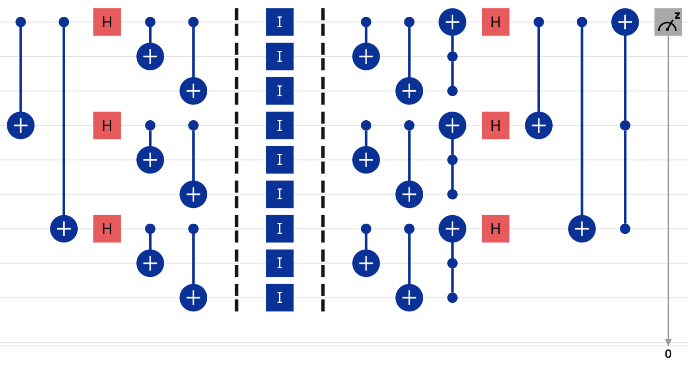

Our results are below. This code was run for the input qubit $$\ket{\psi}=0.689\ket{0}+0.724\ket{1}$$, with the histogram showing the probability distribution of the output qubit across 1024 trials.

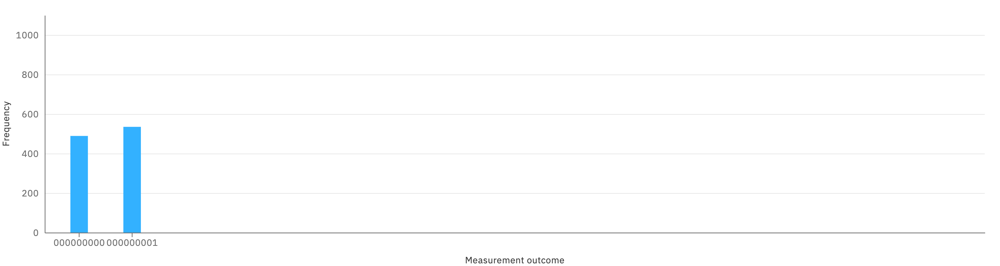
Above is the histogram of results after running the protocol on the Melbourne system.

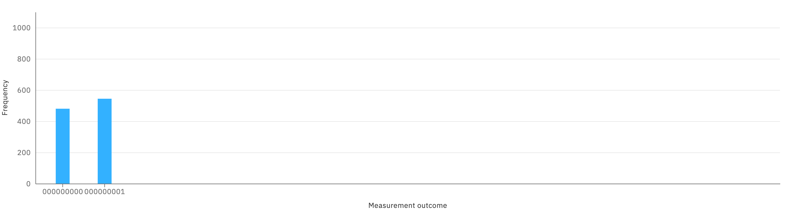
Above is the histogram of results after the control test of the protocol on the QAsm simulator.

The queue times for the Melbourne computer are unfortunately rather long, so we could only enter one trial within the time frame. So far the results seem inconclusive because the histograms match up and are both very similar to simply running the qubit through a series of identity gates (to simulate a noisy channel). We suspect this is because the natural error rate for the qubits in the quantum computer is already low enough that there will be no discernable corruption within such a small circuit.

# 9. The future of quantum error correction

Although Shor’s 9-bit algorithm was a breakthrough in the sense that it provided the first example of working error correction code for quantum computing, it has quite a few limitations. As a result, it’s not in the running as actual error correction, but was crucial as a proof of concept and helped to propel the field forwards.

One main limitation is that it can only handle one arbitrary error. While there are certain arrangements of errors where more than one can be handled, such as a bit flip in each block (totalling three errors), in general one is the limit. For example, if bit flips occur on two qubits in the same block, our bit flip correction code fails to work, giving us the wrong state in the end.

Another limitation is that we assume the error occurs only in one region, and that all of our quantum gates are infallible. In reality though, there’s no reason why noise from the environment couldn’t cause errors in our qubits in other parts of the code. Also, it’s possible for quantum gates to introduce errors as well, since hardware isn’t perfect. Shor’s code breaks down once you drop the nice theoretical assumptions we made. In reality, quantum systems are so sensitive that errors often arise even during processing, i.e. applying quantum gates. This means quantum error correcting codes will be needed much more frequently; in fact, for large quantum systems, they will need to be integrated into each component of the processor itself.


Another limitation is that what we’re preserving is a single qubit. This doesn’t make for a very good logical qubit -- something we can perform quantum algorithms with without worrying much about errors. Even if Shor’s code protects our qubit from an error, immediately after the code, an error could occur on the qubit. Now, if we tried running Shor’s code, the error wouldn’t be fixed, because the new state caused by the error is what would be distributed among the 9 qubits. Modern error correction codes involve logical qubits composed of many physical qubits. That way, when single qubit errors happen, they don’t destroy the whole logical qubit, and can be detected and corrected for.

Before briefly discussing some of the other error correction codes out there, we’ll look at what’s called the quantum threshold theorem. The theorem is stated roughly as follows: “Quantum computers with a physical error rate below a certain threshold can, through application of quantum error correction schemes, suppress the logical error rate to arbitrarily low levels.” 

Like with logic gates in classical computers, quantum gates aren’t infallible. They can introduce errors into our computation, with the “physical error rate” referring to the probability of that happening. However, with the right error correcting code, we’re still able to peform long calculations with good precision. The idea is we can fix the errors faster than they pop up.

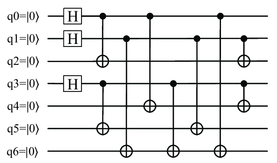

Since the development of Shor’s code, numerous error correcting codes have been devised. One example which closely resembled it was Steane’s code (shown above), which was able to preserve the state of a single qubit using seven qubits instead of nine up to a single arbitrary error. There was another code which involved a logical qubit composed of five physical qubits, using four ancillary qubits (shown below). This is the smallest code which protects against single qubit errors.

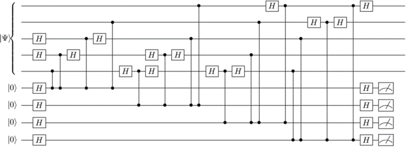

The broader family of error correcting codes which use these ancillary qubits is called stabilizer codes. The ancillary qubits are attached to the qubits we want to protect, allowing us to determine where errors occurred and what kind. We can measure them to find this out, without needing to measure the state we’re trying to protect, therefore preserving its superposition.

A promising candidate currently is surface codes. With these, physical qubits are placed on the edges of a grid pattern to form the larger logical qubit, with stabilizer codes for X or Z gates placed at the grid corners and square centers. When errors occur, the parity in certain groups of four qubits will change, so that measuring the stabilizers shows us where the errors are. Additionally, surface codes include toric codes and planar codes. With toric codes, there’s no problems at the boundaries because it loops back on itself. With planar codes though, it stops at the boundaries, so different stabilizers are used there. Surface codes have a threshold on the order of 1%.

Although Shor's code may not be in the running for quantum error correction code, no one can deny the significant impact it had. By showing that (at least in theory) decoherence could be protected against, the idea of quantum computers took a big step away from our imaginations and towards reality. With these error correcting algorithms continuing to get better, we might be able to have all the benefits of quantum computing without having to worry about the fragility of qubits, which would be incredible.

## References
1. [25 Years of quantum error correction](https://www.nature.com/articles/s42254-020-0244-y.pdf?origin=ppub)
2. [Motives behind quantum error correction](http://decodoku.blogspot.com/2016/02/4-decoding-without-looking.html?m=1)
3. [Quantum Error Correction for Beginners](https://arxiv.org/pdf/0905.2794.pdf)
4. [Quantum Error Correction](https://oxfordre.com/physics/view/10.1093/acrefore/9780190871994.001.0001/acrefore-9780190871994-e-35)
5. [Quantum error correction on Wikipedia](https://en.wikipedia.org/wiki/Quantum_error_correction)
6. [Scheme for reducing decoherence in quantum computer memory](https://www.cs.miami.edu/home/burt/learning/Csc670.052/pR2493_1.pdf)
